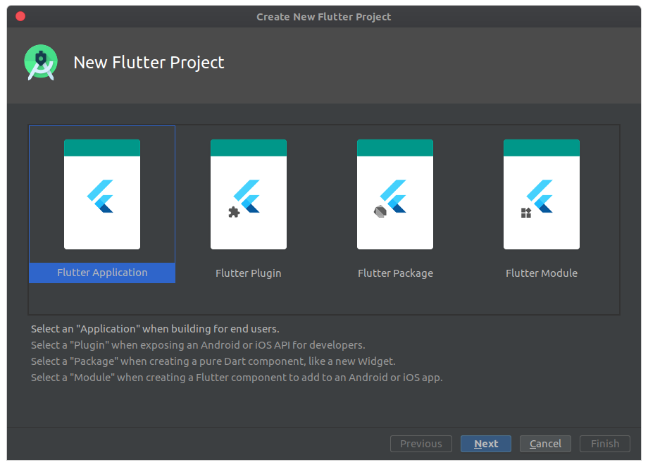

# membuat-aplikasi-pertama-flutter
Baiklah, setelah kita mengenal apa itu flutter dan kita sudah belajar juga cara instalasi flutter pada Android
Studio, barulah sekarang kita memulai membuat aplikasi pertama kita menggunakan framework flutter. Berikut
langkah-langkahnya:   
a. Buatlah project baru pada android studio
 

 
Pada bagian ini pilih option nomor 2 Start a new Flutter project.
  
b. Tampilan New Flutter Project
 

 
Pada bagian ini pilih Flutter Application kemudian klik next
  
c. Disini membuat nama project, lokasi SDK flutter, lokasi project, dan deskripsi aplikasi yang dibuat, kemudian
klik next
 

  
d. Disini untuk set company domain, dan jika include kotlin dan swift. Kemudian finish
 

  
e. Hasil run aplikasi flutter pertama
 

  
f. selesai
   
<b>Note : </b> Code aplikasi flutter terdapat pada <b><i>lib/main.dart</i></b>
    
# Menjalankan Aplikasi
Untuk dapat menjalankan aplikasi pada flutter dapat dengan menggunakan langkah-langkah berikut ini:
  
1. Pada bagian toolbar Android Studio, klik logo play  

 
2. Pada <b>target selector,</b> pilih android device untuk menjalankan aplikasi. Jika tidak ada pilihan yang
tersedia, pilih <b>tools -> Android -> AVD Manager</b> dan membuat salah satu dari yang ada disana.
 
3. Klik icon pada bagian toolbar, atau aktifkan menu item <b>Run -> Run</b>
 
4. Setelah selesai, maka akan muncul tampilan seperti dibawah ini :
 

 
Ini adalah tampilan template default ketika kita membuat project pada flutter.
  
